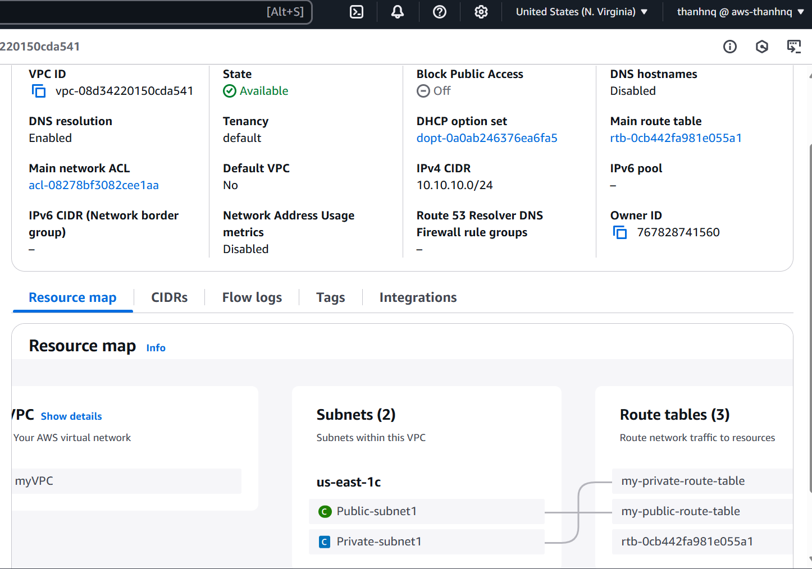
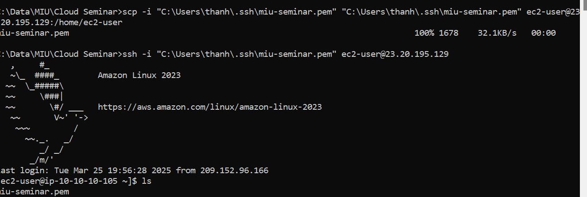

# MIU-Seminar-2025-03-Homework2
# Requirements
* Create a Custom VPC (10.0.0.0/24)
* Set up Two Subnets:
- Public (10.0.1.0/28)
- Private (10.0.2.0/28)
* Create an Internet Gateway & Attach it
* Configure a Route Table for Public Internet Access
* Launch EC2 with Amazon Linux: 
- Launch a public EC2 Instance inside the Public Subnet
- Launch a private EC2 Instance inside the Private Subnet
* Connect to the public and private EC2 from your PC via SSH
* (Optional): Please install Git in your private EC2 instance
## Submit screenshots demonstrating:
* VPC

* Subnets

* Route Table

* Internet Gateway

* EC2 instance

* Connections to EC2 using SSH

